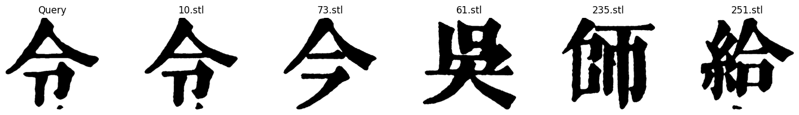
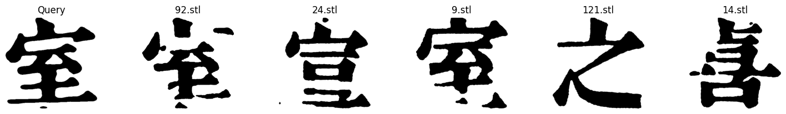

# Sino-nom Character Retrieval: 2D-3D

University of Engineering and Technology

The mid-term major project of the Image Processing Course (INT3404E_20)

## Contributors

| SID | Fullname |
|-------|-------|
| 21021535 | Nguyễn Minh Quân |
| 21021536 | Trần Minh Quân |
| 21021531 | Lê Thế Quang |
| 21021523 | Nguyễn Hiếu Nghĩa |
    

## Description

Search the database (containing STL surfaces of Sino-Nom characters) to find the 5 STL files that are most similar to the 2D Sino-Nom image that is queried.

Evaluation metric: Mean Reciprocal Rank (MRR)

Our approach:

* Using the Trimesh library to read and convert STL surfaces to projections in 2D.
* Apply the SIFT algorithm to sequentially compare the input image against each 3D STL projection, then select the projection that is most similar to the input image.
## Source Code
The source code is set up on Google Colab and consists of 2 notebooks:

* sino-nom_2d_3d_retrieval_prepare_data.ipynb: converts 3D mesh files into 2D projections and performs preprocessing on them and 2D images using various image processing algorithms.
* sift_matching.ipynb: uses the SIFT algorithm to compare the 2D images used for querying against the 3D projections. It then selects the top five most similar projections and outputs a CSV file containing all the results of queries

Instructions to run:

* Open sino-nom_2d_3d_retrieval_prepare_data.ipynb. 

* Run the first two code blocks to connect to Google Drive and create the "Sino-Nom 2D-3D Retrieval" folder

* In the "Sino-Nom 2D-3D Retrieval" folder:
    
    * Open the "input" folder.
    * Upload the 2D images you want to query into the "2d_images" subfolder.
    * Upload the STL surface files you want to use into the "3d_meshes" subfolder.

* Open sift_matching.ipynb. Run the notebook and let it execute completely. Finally, retrieve the CSV file that is generated in the folder Output.
## Results

This is the result obtained after querying a random image.

Or

Full results are in the file sift_matching.csv, you can find them [here](results/sift_result.csv)

With sample data, this result got 0.85 in MRR Score. However, on our evaluation day, with other data, we got only 0.47, so we have many things to do with it.

## Link to full report
You can see our full report about this work [here](https://drive.google.com/file/d/1PqH_5ya-hiKSETDfWQUyJM5FtXt1sMhZ/view?usp=sharing)
